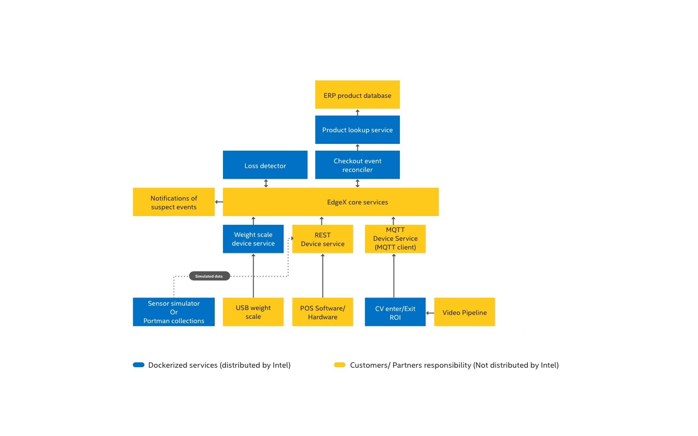

# Real Time Sensor Fusion for Loss Detection at Checkout Reference Design

## Introduction
This guide helps you build and run the Real Time Sensor Fusion for Loss Detection at Checkout Reference Design.

Upon completing the steps in this guide, you will be ready to integrate sensors and services to build your own complete solution.

!!! info
    This guide does not create a complete, ready-to-use solution. Instead, upon completing the steps in this guide, you will be ready to integrate sensors and services to build your own Real Time Sensor Fusion for Loss Detection at Checkout solution.
    
    Certain third-party software or hardware identified in this document only may be used upon securing a license directly from the third-party software or hardware owner. The identification of non-Intel software, tools, or services in this document does not constitute a sponsorship, endorsement, or warranty by Intel.

### Block diagram
The high-level diagram below shows the sensors and services used with the Real Time Sensor Fusion for Loss Detection at Checkout Reference Design. The diagram shows the sensors and services, and how they communicate through EdgeX. Intel provides the services outlined in green, and you must obtain EdgeX and the sensors and services in pink.


### Prerequisites

The following items are required to build the Real Time Sensor Fusion for Loss Detection at Checkout Reference Design. You will need additional hardware and software when you are ready to build your own solution. 

- Point-of-Sale (POS) of choice. You must use a POS that integrates with either the EdgeX REST or MQTT Device. See [POS Events](./rtsf_at_checkout_events/checkout_events.md#pos-events) for information about integration with the [EdgeX Device Services](./device_services.md#edgex-rest-and-mqtt-device-services) to send POS Events
- Docker
- Docker-Compose
- Go 1.12+
- GIT
- make

### Recommended domain knowledge

- MQTT
- REST
- POS systems, including customizations (Transactions, Real-Time Transaction Log (RTTL))
- Computer Vision concepts, if using CV Components
- RFID concepts, if using RFID Components

## Getting started

### Step 1: Clone the repository

```
git clone  https://github.com/intel-iot-devkit/rtsf-at-checkout-reference-design && cd ./rtsf-at-checkout-reference-design
```

### Step 2: Build the reference design

You must build the provided component services and create local docker images. To do so, run:

```
make docker
```
!!! note
    This command may take a while to run depending on your internet connection and machine specifications.

#### Check for success

Make sure the command was successful. To do so, run:

```
docker images
```

!!! success 
    The results are:

    - `rtsf-at-checkout/event-reconciler`
    - `rtsf-at-checkout/device-scale`
    - `rtsf-at-checkout/product-lookup`
    - `rtsf-at-checkout/loss-detector`
    - `rtsf-at-checkout/rsp-controller-event-handler`
    - `rtsf-at-checkout/cv-region-of-interest`

!!! failure
    If you do not see all of the above docker image files, look through the console output for errors. Sometimes dependencies fail to resolve and must be run again. Address obvious issues. To try again, repeat step 2.
    

### Step 3: Start the reference design suite

Use docker-compose to start the reference design suite. To do so, run

```
make run-base
``` 

This command starts the EdgeX Device Services and then starts all the Loss Detection Services.

#### Check for success

Make sure the command was successful. To do so, run:

```
`docker ps --format 'table{{.Image}}\t{{.Status}}'`
```

!!! success
    Your output is as follows:

    | IMAGE                                              | STATUS                   |
    | -------------------------------------------------- | ------------------------ |
    | rtsf-at-checkout/product-lookup:dev                | Up 3 minutes             |
    | rtsf-at-checkout/loss-detector:dev                 | Up 3 minutes             |
    | rtsf-at-checkout/event-reconciler:dev              | Up 3 minutes             |
    | rtsf-at-checkout/rsp-controller-event-handler:dev  | Up 3 minutes             |
    | rtsf-at-checkout/device-scale:dev                  | Up 3 minutes             |
    | edgexfoundry/docker-device-rest-go:1.0.0           | Up 3 minutes             |
    | edgexfoundry/docker-device-mqtt-go:1.1.0           | Up 3 minutes             |
    | edgexfoundry/docker-support-scheduler-go:1.1.0     | Up 3 minutes             |
    | edgexfoundry/docker-core-command-go:1.1.0          | Up 3 minutes             |
    | edgexfoundry/docker-core-data-go:1.1.0             | Up 3 minutes             |
    | edgexfoundry/docker-support-notifications-go:1.1.0 | Up 3 minutes             |
    | edgexfoundry/docker-core-metadata-go:1.1.0         | Up 3 minutes             |
    | edgexfoundry/docker-support-logging-go:1.1.0       | Up 3 minutes             |
    | edgexfoundry/docker-core-config-seed-go:1.1.0      | Exited (0) 3 minutes ago |
    | edgexfoundry/docker-edgex-mongo:1.1.0              | Up 3 minutes             |
    | consul:1.3.1                                       | Up 3 minutes             |
    | edgexfoundry/docker-edgex-volume:1.1.0             | Up 3 minutes             |
    | eclipse-mosquitto:1.5.8                            | Up 3 minutes             |

    Only 'edgexfoundry/docker-core-config-seed-go:1.1.0' should display a status of 'Exited'. If any other service displays 'Exited', repeat step 4.

### Step 4: Dive in

All of the core components of RTSF at Checkout are up and running, and you are ready to begin going through the following phases. 

- [Phase 1](./phases/phase1.md) - Simulate data using either Postman or the Intel-provided Event Simulator
- [Phase 2](./phases/phase2.md) - Integrate POS software using either an open-source POS or your own proprietary POS system
- [Phase 3](./phases/phase3.md) - Integrate your own hardware to complete an end-to-end loss prevention system


## How to use the compose files

The docker-compose files are divided up to let you bring up or take down individual sensor ingestion components. Visit each individual [GitHub subrepository](#references-and-links-to-the-documentation-of-the-individual-components) to learn about the responsibility of each service. 

| Compose file                                                                            | Purpose              | Command                                                     |
| --------------------------------------------------------------------------------------- | -------------------- | ----------------------------------------------------------- |
| Portainer                                                                               | Container management | `docker-compose -f docker-compose.portainer.yml up -d`      |
| EdgeX and its components                                                                |                      | `docker-compose -f docker-compose.edgex.yml up -d`          |
| Real Time Sensor Fusion for Loss Detection at Checkout Core Services and its components |                      | `docker-compose -f docker-compose.loss-detection.yml up -d` |
| RFID Components (Intel® RSP SW Toolkit)                                                 |                      | `docker-compose -f docker-compose.rsp.yml up -d`            |
| Video Analytics Pipeline (VAP)                                                          |                      | `docker-compose -f docker-compose.vap.yml up -d`            |


## Components to build a solution that is based on this reference design

The reference design you created is not a complete solution. It provides the base components for creating a sensor fusion based framework. It is your choice on how many and which sensors to include. This section provides information about components you might want to include or replace.

### Components to consider adding

| Component                                         | Description                                                                                                                                                                                                                                                                                                                                                                                                                                                                                                                                                                                                                                                                                                                                                                                                                                                                         |
| ------------------------------------------------- | ----------------------------------------------------------------------------------------------------------------------------------------------------------------------------------------------------------------------------------------------------------------------------------------------------------------------------------------------------------------------------------------------------------------------------------------------------------------------------------------------------------------------------------------------------------------------------------------------------------------------------------------------------------------------------------------------------------------------------------------------------------------------------------------------------------------------------------------------------------------------------------- |
| Security Scale in Bagging Area                    | A Scale Device Service is provided for a CAS USB scale. As an alternative, you can have Scale Events sent to either the EdgeX REST or MQTT Device Services. See [Scale Events](./rtsf_at_checkout_events/checkout_events.md#scale-events) for more information, including information about integrating with the [EdgeX Device Services](./device_services.md#edgex-rest-and-mqtt-device-services) to which you send  Scale Events.                                                                                                                                                                                                                                                                                                                                                                                                                                                 |
| Computer Vision (CV) Object Detection Model       | The Video Analytics Pipeline (VAP) Service uses the provided Intel® Distribution of OpenVINO toolkit-based object detection model as an example, but this is not intended as your final solution. The VAP and CV ROI Enter Exit Service in this reference design create the CV ROI Events that are sent to the [EdgeX MQTT Device Service](./device_services.md#edgex-mqtt-device-service). See [CV ROI Events](./rtsf_at_checkout_events/checkout_events.md#cv-roi-events).                                                                                                                                                                                                                                                                                                                                                                                                        |
| Intel® RFID Sensors                               | This reference design relies on the **Intel® Retail Sensor Platform (Intel® RSP)** [https://software.intel.com/en-us/retail/rfid-sensor-platform](https://software.intel.com/en-us/retail/rfid-sensor-platform) that has its own custom EdgeX Device Service to which it sends RFID events. These events are transformed into RFID ROI events by the provided **RSP Controller Event Handler** service. See the [RFID ROI Events](./rtsf_at_checkout_events/checkout_events.md#rfid-roi-events). This RSP has its own custom EdgeX Device Service to which it sends RFID events. These events are transformed into RFID ROI Events by the provided RSP Controller Event Handler Service. If you are interested in Intel® RSP RFID Sensors, see [https://software.intel.com/en-us/retail/rfid-sensor-platform#buy](https://software.intel.com/en-us/retail/rfid-sensor-platform#buy) |
| Reconciler Service                                | The service provided performs the analytics of reconciling all the sensor events to identify suspect items. As an option, you can replace the provided service with a more advanced service.                                                                                                                                                                                                                                                                                                                                                                                                                                                                                                                                                                                                                                                                                        |
| Detector Service                                  | The service provided demonstrates how to use the EdgeX Notifications Service to send an email notification. The contents of the email is a simple JSON list of suspect items. As an option, you can replace this service with a more advanced service.                                                                                                                                                                                                                                                                                                                                                                                                                                                                                                                                                                                                                              |
| Computer Vision Region of Interest (ROI) Solution | If you chose to create your own complete Computer Vision object detection and CV ROI enter/exit solution. To use your own solution, exclude running the components in the `docker-compose.vap.yml` compose file and remove the `cv-region-of-interest` from the `docker-compose.loss-detection.yml` compose file. Integrate your CV solution with either the EdgeX REST or MQTT Device Services to which you send CV ROI events.                                                                                                                                                                                                                                                                                                                                                                                                                                                    |


### Components to consider replacing or enhancing

| Component              | Description                                                                                                                                                                                                                                                                                                                                                                                                                                                                                                                                                                                                                                                                                                                                                   |
| ---------------------- | ------------------------------------------------------------------------------------------------------------------------------------------------------------------------------------------------------------------------------------------------------------------------------------------------------------------------------------------------------------------------------------------------------------------------------------------------------------------------------------------------------------------------------------------------------------------------------------------------------------------------------------------------------------------------------------------------------------------------------------------------------------- |
| Reconciler Service     | The provided Reconciler Service performs the analytics of reconciling the sensor events to identify suspect items. While the service provided performs adequately, your analytics team might be able to improve on this reference implementation.                                                                                                                                                                                                                                                                                                                                                                                                                                                                                                             |
| Detector Service       | The provided Dectector Service demonstrates how to send email notifications using the EdgeX Notifications Service. The email message content is a simple JSON list of suspect items.                                                                                                                                                                                                                                                                                                                                                                                                                                                                                                                                                                          |
| Product Lookup Service | The provided service is a basic implementation of a Product Information Management Lookup Service. It uses a JSON file as a database for the product information. It is recommended that you replace the service with an Enterprise Resource Planning (ERP) System.                                                                                                                                                                                                                                                                                                                                                                                                                                                                                           |
| RFID Services          | These services are provided. If you choose to use a different RFID solution, in addition to providing your integration to generate the RFID ROI events, exclude running the components in the `docker-compose.rsp.yml` compose file and remove the `rsp-controller-event-handler` from the `docker-compose.loss-detection.yml` compose file. You will also need to integrate your RFID solution with either the EdgeX REST or MQTT Device Services to which you send RFID events. See [RFID ROI events](./rtsf_at_checkout_events/checkout_events.md#rfid-roi-events) for more information, including information about integrating with [EdgeX Device Services](./device_services.md#edgex-rest-and-mqtt-device-services) to which you send RFID ROI events. |

## Data dictionary

The data dictionary table below describes the JSON object fields for the [Real Time Sensor Fusion for Loss Detection at Checkout Events](./rtsf_at_checkout_events/checkout_events.md#rtsf-at-checkout-events).

| Field name        | Data type | Events used in                                                                                                                                  | Description                                                                                                                                                                                 |
| ----------------- | --------- | ----------------------------------------------------------------------------------------------------------------------------------------------- | ------------------------------------------------------------------------------------------------------------------------------------------------------------------------------------------- |
| `lane_id`         | string    | All                                                                                                                                             | Unique identifier of the self checkout lane                                                                                                                                                 |
| `event_time`      | number    | All                                                                                                                                             | Unix nanosecond timestamp of when the event occured                                                                                                                                         |
| `basket_id`       | string    | All [POS Events](./rtsf_at_checkout_events/checkout_events.md#pos-events)                                                                       | Unique identifier of self checkout session basket                                                                                                                                           |
| `customer_id`     | string    | All [POS Events](./rtsf_at_checkout_events/checkout_events.md#pos-events)                                                                       | Optional unique identifier of the customer using the self checkout.                                                                                                                         |
| `employee_id`     | string    | All [POS Events](./rtsf_at_checkout_events/checkout_events.md#pos-events)                                                                       | Optional unique identifier of the employee overseeing the self checkout.                                                                                                                    |
| `product_id`      | string    | POS [Scanned Item](./rtsf_at_checkout_events/checkout_events.md#pos-events)                                                                     | Unique identifier of the product that was scanned. <br />**This reference design expects a 14 digit UPC**                                                                                   |
| `product_id_type` | string    | POS [Scanned Item](./rtsf_at_checkout_events/checkout_events.md#pos-events)                                                                     | Type of the associated product ID. Value can be `UPC`, `SKU`, or `PLU`. <br />**This reference design expects `UPC`**                                                                       |
| `product_name`    | string    | POS [Scanned Item](./rtsf_at_checkout_events/checkout_events.md#pos-events)                                                                     | Name of the product that was scanned                                                                                                                                                        |
| `quantity`        | number    | POS [Scanned Item](./rtsf_at_checkout_events/checkout_events.md#pos-events)                                                                     | Quantity of the products that were scanned                                                                                                                                                  |
| `quantity_unit`   | string    | POS [Scanned Item](./rtsf_at_checkout_events/checkout_events.md#pos-events)                                                                     | Units for the associated quantity. <br />Values can be `EA`, `Each`, `lbs`, `g`, `kg` or `oz`<br />**This reference design expects `EA`, `Each`, or `lbs`**                                 |
| `unit_price`      | number    | POS [Scanned Item](./rtsf_at_checkout_events/checkout_events.md#pos-events)                                                                     | Price of the individual products scanned.                                                                                                                                                   |
| `scale_id`        | string    | [Scale Item](./rtsf_at_checkout_events/checkout_events.md#scale-events)                                                                         | Unique identifier for the scale sending the events                                                                                                                                          |
| `total`           | number    | [Scale Item](./rtsf_at_checkout_events/checkout_events.md#scale-events)                                                                         | Total weight for items on the scale                                                                                                                                                         |
| `units`           | string    | [Scale Item](./rtsf_at_checkout_events/checkout_events.md#scale-events)                                                                         | Units for the associated total weight.<br />Values can be `lbs`, `g`, `kg` or `oz` <br />**This reference design expects `lbs`**                                                            |
| `product_name`    | string    | [CV ROI](./rtsf_at_checkout_events/checkout_events.md#cv-roi-events)                                                                            | Unique identifier of the product identified by CV object detection.                                                                                                                         |
| `roi_action`      | string    | [CV ROI](./rtsf_at_checkout_events/checkout_events.md#cv-roi-events) & [RFID ROI](./rtsf_at_checkout_events/checkout_events.md#rfid-roi-events) | Action of the associate product identified.<br />Value can be either `ENTERED` or `EXITED`.                                                                                                 |
| `roi_name`        | string    | [CV ROI](./rtsf_at_checkout_events/checkout_events.md#cv-roi-events) & [RFID ROI](./rtsf_at_checkout_events/checkout_events.md#rfid-roi-events) | Name of the region that the associate product was identified with. See the [Configuration](./configuration.md#configuration) section above for details on how these names after configured. |
| `epc`             | string    | [RFID ROI](./rtsf_at_checkout_events/checkout_events.md#rfid-roi-events)                            | Unique EPC code of the product identified by RFID            |

