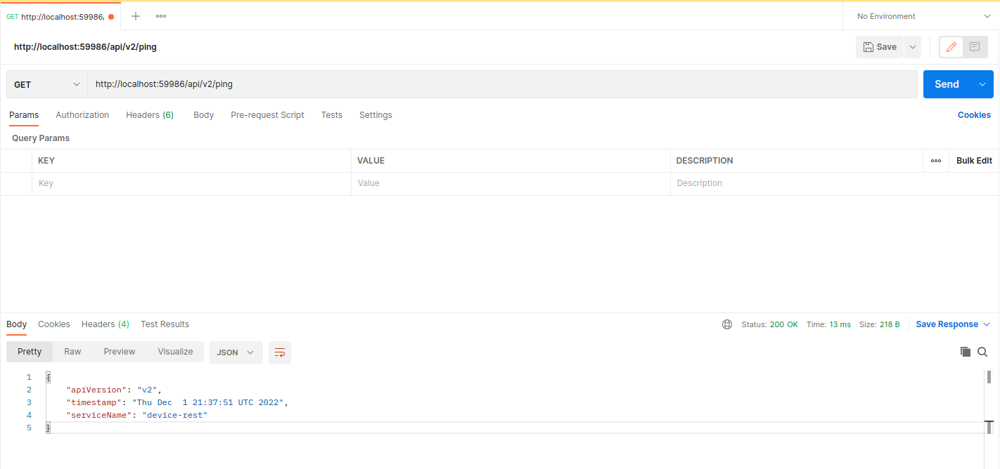

# Phase 1 - Simulate Events

## Overview

The Phase 1 steps in this guide show you how to use [Postman](https://www.getpostman.com/downloads/) to send events to device-rest to simulate a sensor fusion loss-detection system. To use this simulation, you will send [POS Events](../rtsf_at_checkout_events/checkout_events.md#pos-events), [Scale Events](../rtsf_at_checkout_events/checkout_events.md#scale-events), [CV ROI Events](../rtsf_at_checkout_events/checkout_events.md#cv-roi-events), and [RFID ROI Events](../rtsf_at_checkout_events/checkout_events.md#rfid-roi-events) as HTTP Post requests.

The concepts you will learn in this guide also apply to sending MQTT events to device-mqtt.

!!! note 
    [MQTT.fx](https://mqttfx.jensd.de/) is a useful tool for composing MQTT events for testing and simulation.

### Scenario

The scenario you will complete is to:

- Open a basket
- Scan one POS item
- Close the transaction

For each operation the expected successes and failures are as follows:
!!! success
    Response Status Code 200 OK.
    The event-reconciler docker logs show the event being processed.

!!! failure
    Response Status Code 404 or no response
    The event-reconciler docker logs show an error while processing the event, or no events are in the event-reconciler logs

## Getting Started

1. Install [Postman](https://www.getpostman.com/downloads/).
2. Complete steps 1-4 in [Getting Started](../index.md#step-1-clone-the-repository).
3. Make sure the containers are all up and running.
4. Open the docker logs in a terminal window. This lets you make sure checkout events are processed correctly. To open the docker logs:

   ```
   docker logs -f event-reconciler
   ```

Continue to the next section to start using Postman to create a simulated scenario. As an alternative to Postman, you can use the [Event Simulator](../rtsf_at_checkout_events/event_simulation.md) to test and explore the example reference design. 


## Confirm device-rest is online

1. Open Postman.
2. Send an HTTP GET request to <http://localhost:59986/api/v3/ping> to test the device-rest operation. This makes sure the service is online.



!!! success
    You see the `version number` of the service returned and a status code of `200`.

!!! failure
    If you get a Response Status Code 404 or get no response, make sure you correctly built and ran device-rest, according to the instructions in step 3 of [Getting Started](rtsf-at-checkout-reference-design/#step-1-clone-the-repository). Do not continue until you successfully receive a status code of '200'

You are ready to initiate your first transaction.


## Initiate a transaction

`basket-open` send a POST request to <http://localhost:59986/api/v3/resource/pos-rest/basket-open> with body:

```json
{
    "lane_id":"1",
    "basket_id": "abc-012345-def",
    "customer_id": "joe5",
    "employee_id": "mary1",
    "event_time":15736013930000
}
```


## Scan an item

`scanned-item` send a POST request to <http://localhost:59986/api/v3/resource/pos-rest/scanned-item> with body:

```json
{
    "lane_id":"1",
    "basket_id": "abc-012345-def",
    "product_id": "00000000571111",
    "product_id_type": "UPC",
    "product_name": "Trail Mix",
    "quantity": 1,
    "quantity_unit": "EA",
    "unit_price": 5.99,
    "customer_id": "joe5",
    "employee_id": "mary1",
    "event_time":15736013940000
}
```

## Prepare for payment

`payment-start` send a POST request to <http://localhost:59986/api/v3/resource/pos-rest/payment-start> with body:

```json
{
    "lane_id":"1",
    "basket_id": "abc-012345-def",
    "customer_id": "joe5",
    "employee_id": "mary1",
    "event_time":15736013950000
}
```

#### Payment succeeded

`payment-success` send a POST request to <http://localhost:59986/api/v3/resource/pos-rest/payment-success> with body:

``` json
{
    "lane_id":"1",
    "basket_id": "abc-012345-def",
    "customer_id": "joe5",
    "employee_id": "mary1",
    "event_time":15736013960000
}
```

#### Transaction is closed

`basket-close` send a POST request to <http://localhost:59986/api/v3/resource/pos-rest/basket-close> with body:

``` json
{
    "lane_id":"1",
    "basket_id": "abc-012345-def",
    "customer_id": "joe5",
    "employee_id": "mary1",
    "event_time":15736013970000
}
```

You have successfully created a simulated scenario with the POS. Next, you will use Postman Collections to explore more complicated scenarios.

## Using Postman Collections

Instead of manually making HTTP calls for each event, Intel provides several full scenarios as Postman Collections. These collections test different sensor combinations, various products, and customer behaviors. You can include and build on the Postman Collections to:

- Understand the reference solution
- Generate simulated data to test or improve the reconciliation algorithm
- Simulate one or more device(s) so your own device can run alongside other simulated devices
- Perform testing and validation

To use the Postman Collections:

1. Open Postman.
2. Click 'Import'.
3. Click 'Choose Files'.
4. Select the [included collections](https://github.com/intel-iot-devkit/rtsf-at-checkout-reference-design/blob/master/loss-detection-app/postman-collections).
5. After the import completes, mouse over the collection you want to run and click 'play'.
6. Click 'run' to open the Collection Runner.
7. Click 'Run ...' to start the simulated transaction.


!!! success
    In the event-reconciler logs, the result of running a non-suspect collection is `No suspect items detected`. The result of running a collection that contains suspect items is a json message containing the suspect lists.

``` json
{
   "cv_suspect_list": [...],
   "rfid_suspect_list": [...],
   "scale_suspect_list": { ... }
}
```

## Summary

You have successfully created a simulated reference design containing multiple sensors. Your next step is to integrate your own components to create your own Real Time Sensor Fusion for Loss Detection at Checkout solution.
