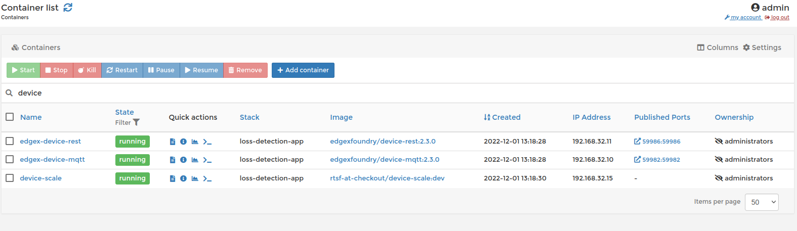
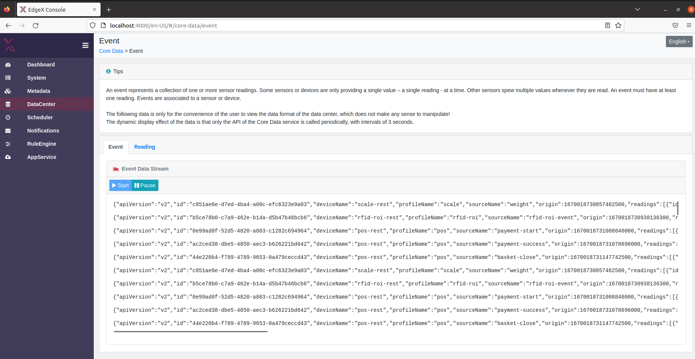

The following guide will help walk you through the flow of data to address potential issues as they occur. 

## Ensuring your Device Services receive data 

All sensor data that is ingested in RTSF at Checkout flows through a device service as the first step. These device services are the first place we should check to ensure they are both running and ingesting data. One of the best ways to do to this is to leverage Portainer (included in EdgeX Releases). 

*Portainer* *is a tool to help manage Docker containers. To learn more visit:* [*https://www.portainer.io/overview/*](https://www.portainer.io/overview/) 

We have 4 device services of note in RTSF at Checkout: 

- Weigh Scale Device Service – Used for USB Weight Scale Devices 

- MQTT Device Service –  Optionally used for all events 
- REST Device Service - Optionally used for all events

We can type “device” in the search bar and see all the device service containers that are in our stack. We can also see their current state which indicates if they are running or not. If a service is not running, or is in a “stopped” state, then this is likely the cause of data not flowing through. 

However, if the state is “running”, we can dig a little deeper by viewing the logs. Though, before we dig into the logs, it is important to call out that we will want to ensure that the logging level is set to “TRACE” for each service we intended to inspect. This can be accomplished by going to Consul located at [http://localhost:8500](http://localhost:8500/), and navigating to the LogLevel property located in the Writable section of the service of interest. 

## Ensuring EdgeX Core Services has received Data 

After ensuring that data is flowing properly to the Device Services, the next place to check would be EdgeX’s Core Data service. You can follow the same steps as above to see if data is flowing and check the logs. you can run edgex-ui `http://localhost:4000/` to view the event.

Once you have clicked the start button, then you will see events coming up.

## Checking the Reconciler (App Service) 

After ensuring data has made it to the database, the next place to check is the Reconciler App Service. Similar to what we did in Step 1, let’s check Portainer for the status of this container to ensure it is running and lets also take a look at the logs. After ensuring the logging level is set to ‘TRACE’, we should see something akin to the following: 

In the unlikely event that no data is flowing at all to the reconciler. This would lead us to an issue with the ZMQ connection from the App Service to Core Data. Double checking the TOML configuration where the hostname, port and topic is specified would be a good place to start. You should also check that the App Service is on the same docker network and is accessible via the network. 

Once connectivity issues have been resolved, the next step is to ensure that all filters (I.e. Device-names) are correct and match what is shown in the database from the previous step. If they do not match, then they will be filtered out and not be processed. One easy way to confirm that data is flowing is to remove filters entirely from the pipeline to see that there is data flowing. 

This guide is not meant to be comprehensive but aims to help guide you through the flow of data between the services to assist in troubleshooting. For further troubleshooting visit the EdgeX documentation 
